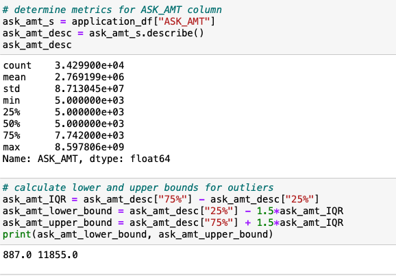
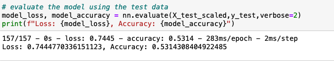
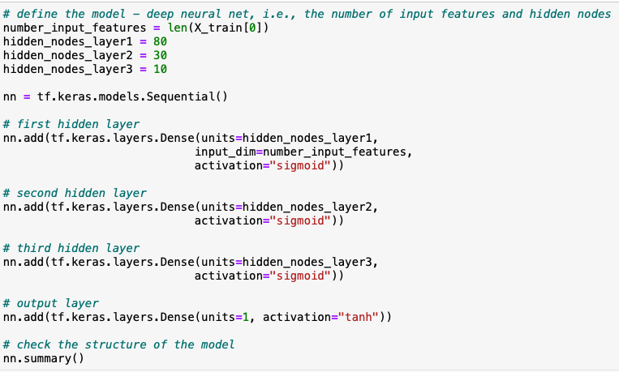
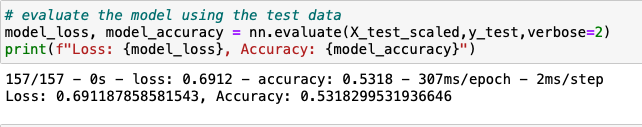
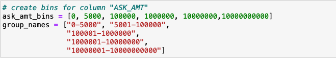
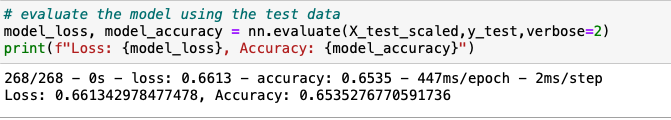

# Neural_Network_Charity_Analysis

## 
PURPOSE

###
The purpose of this analysis is to create a binary classifier that can predict whether applicants will be successful if funded by Alphabet Soup. 

## 
RESULTS

###
The business team at Alphabet Soup provided a CSV file containing more than 34,000 organizations that received funding from Alphabet Soup over the
years. The file contained different data about each organization. 
The following data preprocessing was performed. 
•	  Target variable was set as column “IS_SUCCESSFUL”.
•	  Feature variabls were set to columns “APPLICATION_TYPE”, “CLASSIFICATION”, “USE_CASE”, “ORGANIZATION”, “STATUS”, “INCOME_AMT”,
“SPECIAL_CONSIDERATIONS” and “ASK_AMT”.
•	  Non-beneficial columns “EIN” and “NAME” were removed.
The following compiling, training and evaluation of the model was performed. 
•	  Number of inputs was set at 43 and number of layers was set at 2. The first layer was set at 80 neurons and second layer at 30 neurons. Activation 
function for both layers was set to relu, while the activation function for output layer was set to sigmoid.  
•	  Model achieved an accuracy of 60.1%. 

Three additional attempts were made to increase the model performance  above 75%. 

o	Attempt #1: Removed additional columns and reviewed for possible outliers
  	Columns “SPECIAL_CONSIDERATIONS” and “STATUS” were removed. The two columns were selected because data within the columns was binary and was
  overwhelmingly one-sided. For example, there were only 5 instances in “STATUS” column that were 0 as compared to 32,294 that had 1.  
  	Describe() method was used to determine the range of column “ASK_AMT”, noting the min ask amount was 5,000 while the max ask amount exceeded 8
  billion. Given the significant range, lower and upper bounds were calculated for “ASK_AMT” column to identify possible outliers. The lower bound
  was calculated as 887 (=Q1 - 1.5 * IQR) and upper bound as 11,855 (=Q3 + 1.5*IQR). Column “ASK_AMT” was filtered to exclude the outliers.
  
  
  	Model was re-ran achieving an accuracy of 53.1%.
  
  

o	Attempt #2: Adjusted the number of layers and activation function in model, all other changes made in Attempt #1 were kept. 
  	Third layer was added to the model. The number of neurons set was at 10. Activation function was changed to sigmoid for hidden layers and to tanh
  for output layer. 
  
  
  	Model was re-ran achieving an accuracy of 53.2%. 
  
  

o	Attempt #3: Created bins for “ASK_AMT” column
  	Removed any filters in column “ASK_AMT” made in previous models. All other changes made were kept. 
  	Created bins to bucket data in column “ASK_AMT” reducing the number of unique instances from 8,747 to 5. 
  
  
  	Model was re-ran achieving an accuracy of 65.4%.
  
  

##
SUMMARY

###
As the original model achieved an accuracy of 60.1%, three additional attempts were made to increase the accuracy by changing various aspects of the 
model. Of the three attempts, the third attempt resulted in the highest accuracy at 65.4%. In this model, bins were created to bucket the data in the
column “ASK_AMT”. Also, activation functions sigmoid and tanh were used for first three hidden layers and output layer, respectively. Many of the
changes were made on a trial and error basis. Additional adjustments can be made to the model in third attempt to continue to increase the 
performance, including adding more neurons to hidden layers, adding more hidden layers and/or changing the activation functions for the layers. It is
not recommended to increase the number of epochs as loss and accuracy results tapered off.  
